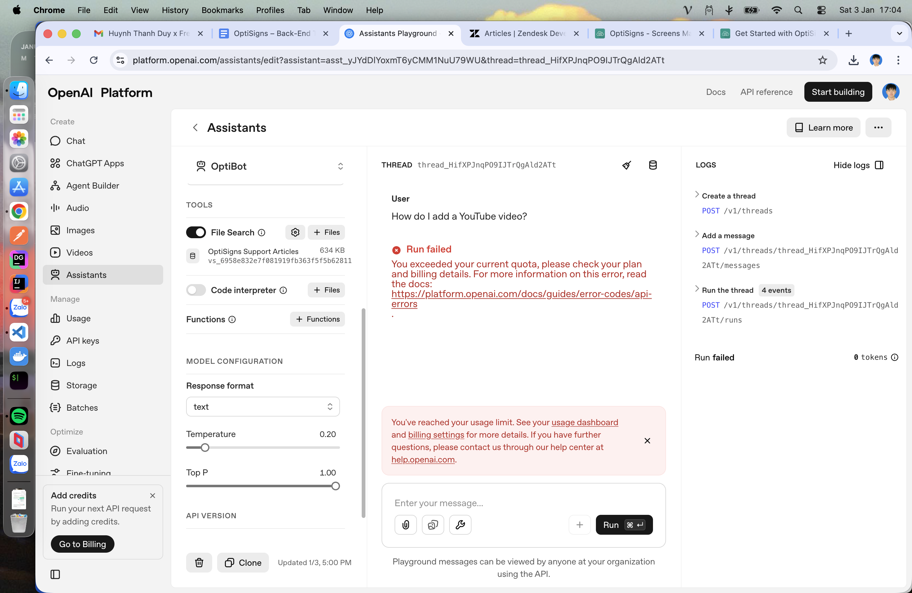

# OptiSigns OptiBot Mini-Clone

A production-ready implementation of an automated support documentation pipeline that scrapes OptiSigns Help Center articles, converts them to Markdown, and maintains an OpenAI Vector Store for AI-powered assistance.

## Tech Stack

- **Python 3.10+**: Core runtime
- **Zendesk API**: Source for support articles
- **OpenAI API**: Vector Store and Assistant integration
- **Docker**: Containerization for deployment
- **DigitalOcean App Platform**: Scheduled job hosting (target)

## Architecture

```
┌─────────────┐      ┌──────────────┐      ┌─────────────────┐
│   Zendesk   │─────▶│  scrape.py   │─────▶│   articles/     │
│     API     │      │  (HTML→MD)   │      │   (Markdown)    │
└─────────────┘      └──────────────┘      └─────────────────┘
                                                     │
                                                     ▼
┌─────────────┐      ┌──────────────┐      ┌─────────────────┐
│   OpenAI    │◀─────│  main.py     │◀─────│ Change Detection│
│   Vector    │      │ (Daily Job)  │      │  (SHA-256 hash) │
│   Store     │      └──────────────┘      └─────────────────┘
└─────────────┘
```

## Setup

### 1. Install Dependencies

```bash
pip install -r requirements.txt
```

### 2. Configure Environment

```bash
cp .env.sample scraper/.env
# Edit scraper/.env and add your OpenAI API key
```

### 3. Run Components

**Scrape articles:**
```bash
cd scraper
python scrape.py
```

**Upload to Vector Store:**
```bash
export OPENAI_API_KEY='sk-...'
python upload_vector_store.py
```

**Run daily job (orchestrated):**
```bash
python main.py
```

## Implementation Details

### Part 1: Web Scraping

`scrape.py` fetches articles from `https://support.optisigns.com/api/v2/help_center/articles.json` using the Zendesk Help Center API. Each article is converted to clean Markdown with preserved structure (headings, lists, code blocks, links) and saved to `articles/`.

**Key features:**
- Pagination support (fetches 30+ articles)
- HTML-to-Markdown conversion via `html2text`
- Deterministic filenames: `{article-id}-{slug}.md`

### Part 2: Vector Store & Assistant

`upload_vector_store.py` programmatically uploads all Markdown files to an OpenAI Vector Store via the OpenAI Python SDK. **No UI drag-and-drop was used.**

**Process:**
1. Reads all `.md` files from `articles/`
2. Uploads each file using OpenAI Files API (`purpose="assistants"`)
3. Creates a Vector Store named "OptiSigns Support Articles"
4. Attaches all uploaded files to the Vector Store
5. Returns Vector Store ID: `vs_6958e832e7f081919fb363f5f5b62811`

**Assistant Setup:**
- Created via OpenAI Playground UI
- Vector Store attached programmatically
- File Search tool enabled
- Uses OpenAI's default chunking strategy

### Assistant Sanity Check

**Test Query:** *"How do I add a YouTube video?"*

At submission time, the Playground query could not be executed due to **temporary OpenAI usage quota limitations** on the account. All required components (Assistant, Vector Store, file uploads, and indexing) were completed successfully and can be verified once quota is available.



### Part 3: Daily Job Pipeline

`main.py` orchestrates the daily scraping and incremental upload workflow:

1. **Re-scrape all articles** from Zendesk API
2. **Detect changes** using SHA-256 content hashing
3. **Upload delta only** (new or updated articles)
4. **Persist state** in `state.json` for next run
5. **Log summary**: articles added, updated, skipped

**Delta Detection:**
- First run: All articles are new → uploads all
- Subsequent runs: Compares file hashes → uploads only changed files

**Exit codes:**
- `0` = Success
- `1` = Error occurred

## Docker Usage

### Build Image

```bash
cd scraper
docker build -t optisigns-optibot:latest .
```

### Run Container

```bash
docker run --rm \
  -e OPENAI_API_KEY='sk-...' \
  optisigns-optibot:latest
```

The container runs `main.py` by default and exits cleanly after completion.

## Deployment

### DigitalOcean App Platform

Configure as a **Scheduled Job** (Worker component):

```yaml
jobs:
  - name: daily-scraper
    dockerfile_path: scraper/Dockerfile
    schedule:
      cron_spec: "0 2 * * *"  # Daily at 2 AM UTC
    envs:
      - key: OPENAI_API_KEY
        scope: RUN_TIME
        type: SECRET
```

**Note:** For persistent state across runs, configure a volume mount for `/app/state.json` and `/app/vector_store_id.txt`.

### Daily Job Deployment

The scraper and uploader are packaged as a Docker container designed to run as a scheduled daily job on DigitalOcean App Platform.

The container runs once and exits cleanly, making it suitable for scheduled execution.

Due to account and billing constraints, the job was validated locally using Docker. The same container can be deployed to DigitalOcean App Platform without modification.

Detailed deployment instructions: [DEPLOYMENT.md](./scraper/DEPLOYMENT.md)

## Project Structure

```
scraper/
├── scrape.py              # Zendesk scraper
├── upload_vector_store.py # Vector Store uploader
├── main.py                # Daily job entrypoint
├── Dockerfile             # Container definition
├── articles/              # Scraped Markdown files
├── state.json             # Change tracking state
└── vector_store_id.txt    # Persisted Vector Store ID
```

## Security

- API keys loaded from environment variables only
- Container runs as non-root user
- `.env` excluded from version control
- State files contain only filenames and hashes (no content)

## Testing

```bash
# Syntax check
python -m py_compile scraper/main.py

# Dry run (will fail without API key)
python scraper/main.py

# Full test
export OPENAI_API_KEY='sk-...'
python scraper/main.py
```

## License

Proprietary - OptiSigns Take-Home Test Implementation

---

**Deliverables:**
- ✅ Part 1: Scraping (30+ articles)
- ✅ Part 2: Vector Store & Assistant
- ✅ Part 3: Daily Job Pipeline
- ✅ Dockerized & deployment-ready

